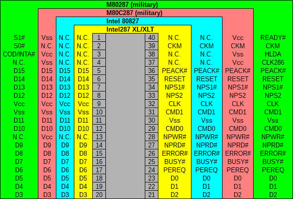
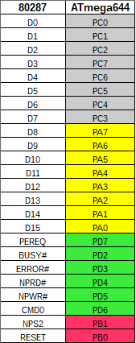

# ATmega-meets-FPU
Proof of concept connecting ATmega644 with the good old 80287 math coprocessor.

## Various pin assignments of the Intel's 80287

## ATmega644 ports connected to 80287

## Top of the board

## Bottom of the board

## The good old 80287 math coprocessor

